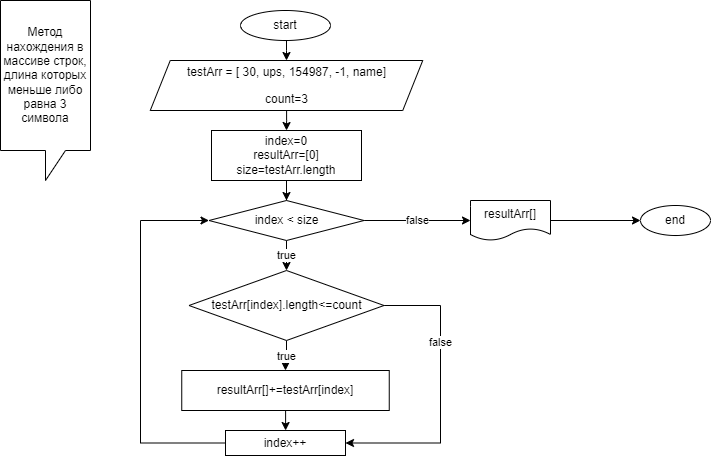

## Задача: 
*Написать программу, которая из имеющегося массива строк формирует массив из строк, длина которых меньше либо равна 3 символа. Первоначальный массив можно ввести с клавиатуры, либо задать на старте выполнения алгоритма.*
## Решение:
1. Первоначальный массив задается на старте выполнения алгоритма.
2. Для вывода в консоль исходного и конечного массивов применяется метод void Print1DArr(string[] arr). Метод принимает одномерный массив типа string [], ничего не возвращает, выводит массив в консоль.
3. Для нахождения в массиве строк, длина которых меньше либо равна 3 символа, применяется метод string[] ThreeSimbArray(string[] arr, int count). Метод принимает одномерный массив строк и целое значение типа int - длину строки. Результатом работы метода является новый одномерный массив строк, длина которых меньше либо равна count.
   

